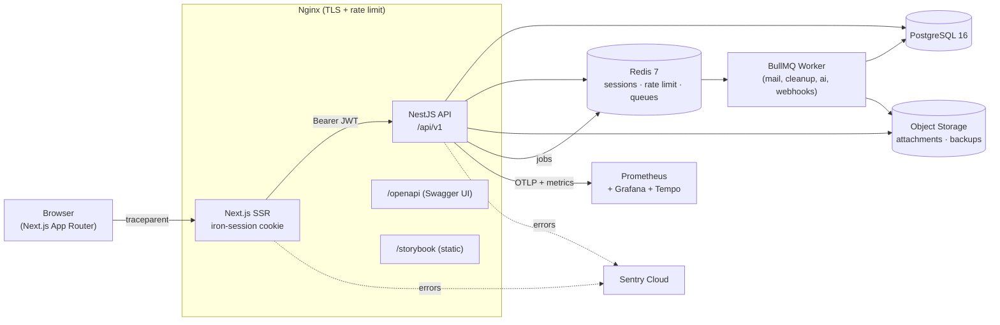

# Tasker

É um SaaS de gestão de projetos multi-tenant. TypeScript de ponta a ponta. NestJS + Prisma no backend, Next.js (App Router) no frontend, Socket.IO para tempo real.


## Experimente a demo (somente leitura)

> A conta abaixo entra em todos os workspaces como `DEMO_VIEWER`. Dá para navegar por tudo, mas qualquer tentativa de criar, editar ou apagar retorna `403` no formato Problem Details com o motivo "read-only demo". Duas camadas garantem isso: o `DemoReadOnlyGuard` no HTTP e uma extensão do Prisma na camada de persistência.

- **URL pública**: Está sem no momento
- **E-mail**: `demo@tasker.dev`
- **Senha**: `DemoViewer!2026`

Se quiser testar os fluxos de criação, edição e remoção, cadastre um workspace novo.

## Destaques

- **Multi-tenant desde o dia zero.** Banco compartilhado com schema compartilhado, `workspaceId` obrigatório em toda linha e isolamento aplicado por uma extensão do Prisma. Mesmo que uma query esteja errada, nenhum método de repositório vaza dados entre tenants.
- **Observabilidade embutida.** Logs estruturados com Pino e `traceId`/`userId`/`workspaceId` propagados via CLS, spans OpenTelemetry (Tempo), métricas Prometheus com dashboards de SLO e captura de erros no Sentry (com filtro de 4xx e rate-limit por fingerprint).
- **Segurança endurecida.** CSRF double-submit, CSP estrita, cookies com `iron-session`, hash de senha com argon2id, verificação no HIBP ao definir senha, validação de entrada com Zod, respostas de erro no padrão RFC 7807. No CI: `gitleaks` + `pnpm audit --audit-level=critical`.
- **Tempo real.** Socket.IO com adapter Redis para escalar horizontalmente e propagação de `traceparent` (W3C) na troca de tickets.
- **IA.** Porta `LlmProvider` com adapter Anthropic (padrão) e OpenAI (fallback), prompt caching por workspace e orçamento de tokens por workspace.
- **CI completo.** Vitest (unit + integração), Testcontainers para Postgres/Redis, Playwright para E2E, gate de cobertura e checagem de drift do OpenAPI.

## Arquitetura



## Pré-requisitos

- Node.js ≥ 24 LTS ([nvm](https://github.com/nvm-sh/nvm): `nvm use`)
- pnpm ≥ 10 (`npm install -g pnpm`)
- Docker Engine ≥ 24

## Como rodar (passo a passo)

```bash
# 1. Instalar dependências
pnpm install

# 2. Copiar o arquivo de env e preencher os valores
cp .env.example .env

# 3. Subir os serviços de dev (Postgres, Redis, Mailhog, MinIO)
docker compose -f infra/docker-compose.yml up -d

# 4. Rodar as migrações do Prisma
pnpm --filter api exec prisma migrate deploy

# 5. Popular o dataset de demo (5 workspaces, 20 usuários, 200 tarefas, viewer da demo)
pnpm --filter api seed

# 6. Subir os servidores de dev
pnpm dev
```


- **API**: <http://localhost:3001/api/v1/health>
- **Documentação da API**: <http://localhost:3001/api/v1/docs> (spec cru em <http://localhost:3001/api/v1/openapi.json>)
- **Web**: <http://localhost:3000>
- **Mailhog (inbox de e-mails de teste)**: <http://localhost:8025>
- **Console do MinIO**: <http://localhost:9001> (`minioadmin` / `minioadmin`)

Para simular um incidente e testar os alertas (Sentry + burn-rate no Grafana), rode `pnpm --filter api simulate-incident`.

## Licença

MIT. Veja [`LICENSE`](LICENSE).
