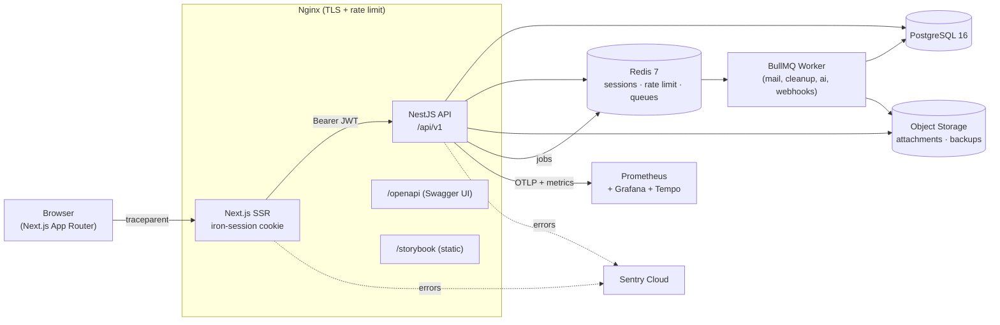

# Tasker

Multi-tenant project management SaaS. TypeScript end to end — NestJS + Prisma on the backend, Next.js App Router on the frontend, Socket.IO for real-time.

<!--
Badges — replace `davipavone/tasker` with the actual GitHub slug once the
repository is public.
-->


## Try the read-only demo

> **Read-only demo** — the account below is scoped to `DEMO_VIEWER` in every workspace. Every read works; every mutation returns `403 Problem Details` with a "read-only demo" reason. Two independent gates enforce this: `DemoReadOnlyGuard` at the HTTP layer and a `demo-read-only` Prisma extension at the persistence layer.

- **URL**: <https://tasker.example.dev> (published after Task 7.0 lands the Nginx+TLS stack)
- **Email**: `demo@tasker.dev`
- **Password**: `DemoViewer!2026`

Sign up for your own workspace to explore create/edit/delete flows.

## Highlights

- **Multi-tenant from day one** — shared-DB, shared-schema, mandatory `workspaceId`, tenant-isolation enforced by a Prisma client extension so no repository method can leak across tenants even if the SQL is wrong.
- **Observability included** — structured Pino logs with CLS-scoped `traceId`/`userId`/`workspaceId`, OpenTelemetry spans (Tempo), Prometheus metrics with SLO dashboards, Sentry error capture (4xx suppression + per-fingerprint rate limits).
- **Security-hardened** — double-submit CSRF, strict CSP, `iron-session` cookies, argon2id password hashing, HIBP breach check on password set, Zod-validated I/O, RFC 7807 problem responses, `gitleaks` + `pnpm audit --audit-level=critical` in CI.
- **Realtime** — Socket.IO with Redis adapter for horizontal fan-out, W3C traceparent propagation across ticket exchange.
- **AI** — `LlmProvider` port with Anthropic default + OpenAI fallback, prompt caching per workspace, per-workspace token budget.
- **Full CI** — Vitest unit + integration, Testcontainers for Postgres/Redis, Playwright E2E, coverage gate, OpenAPI drift check.

## Architecture



The full technical spec lives at [`tasks/prd-observability-and-production/techspec.md`](tasks/prd-observability-and-production/techspec.md). Every non-obvious choice is captured as an ADR under [`docs/adr/`](docs/adr/) and rendered in-app at `/docs`.

## Prerequisites

- Node.js ≥ 24 LTS ([nvm](https://github.com/nvm-sh/nvm): `nvm use`)
- pnpm ≥ 10 (`npm install -g pnpm`)
- Docker Engine ≥ 24

## Quick start

```bash
# 1. Install dependencies
pnpm install

# 2. Copy env file and fill in values
cp .env.example .env

# 3. Boot dev services (Postgres, Redis, Mailhog, MinIO)
docker compose -f infra/docker-compose.yml up -d

# 4. Apply Prisma migrations
pnpm --filter api exec prisma migrate deploy

# 5. Seed the demo dataset (5 workspaces, 20 users, 200 tasks, demo viewer)
pnpm --filter api seed

# 6. Start dev servers
pnpm dev
```

- **API**: <http://localhost:3001/api/v1/health>
- **API docs**: <http://localhost:3001/api/v1/docs> (raw spec at <http://localhost:3001/api/v1/openapi.json>)
- **Web**: <http://localhost:3000>
- **Mailhog UI**: <http://localhost:8025>
- **MinIO console**: <http://localhost:9001> (`minioadmin` / `minioadmin`)

## Scripts

| Command | Description |
|---------|-------------|
| `pnpm dev` | Start all apps in parallel |
| `pnpm build` | Build all apps |
| `pnpm lint` | Lint all workspaces |
| `pnpm typecheck` | Type-check all workspaces |
| `pnpm test` | Run all test suites |
| `pnpm --filter api seed` | Populate the demo dataset (idempotent) |
| `pnpm --filter api simulate-incident` | Fire the alerting drill (Sentry + Grafana burn-rate) |

### Public API — quickstart

The public REST surface is mounted under `/api/v1/public/*` and authenticates
via API keys minted from Settings → Platform → API keys. Every response
carries `X-RateLimit-Limit`, `X-RateLimit-Remaining`, `X-RateLimit-Reset`,
and `X-Request-Id`. Errors use RFC 7807 Problem Details.

```bash
# Introspect the acting key (any scope)
curl -H "Authorization: Bearer tsk_live_..." \
  http://localhost:3001/api/v1/public/workspaces/<slug>/me

# List projects (needs projects:read scope)
curl -H "Authorization: Bearer tsk_live_..." \
  "http://localhost:3001/api/v1/public/workspaces/<slug>/projects?limit=20"

# List tasks in a project (needs tasks:read)
curl -H "Authorization: Bearer tsk_live_..." \
  "http://localhost:3001/api/v1/public/workspaces/<slug>/projects/<project-slug>/tasks?limit=20"

# Create a task (needs tasks:write + Idempotency-Key)
curl -X POST -H "Authorization: Bearer tsk_live_..." \
  -H "Content-Type: application/json" -H "Idempotency-Key: $(uuidgen)" \
  -d '{"title":"Refresh nightly report","priority":"MEDIUM"}' \
  "http://localhost:3001/api/v1/public/workspaces/<slug>/projects/<project-slug>/tasks"
```

Missing-scope responses use `about:blank#api-key-missing-scope` (HTTP 403);
missing-auth responses use `#api-key-unauthorized` (401); rate limit
exhaustion returns `#rate-limit-exceeded` (429) with a `Retry-After` header
in seconds.

### Webhooks

Register a subscription from Settings → Platform → Webhooks. Each delivery
carries `Tasker-Signature: t=<unix>,v1=<hex hmac_sha256(secret, "<t>.<body>")>`.
Signing secret is shown once at create + once after rotate. See
[`docs/platform.md`](docs/platform.md) for the receiver-side verification
snippets (Node + Python) and DLQ semantics.

### Integrations

GitHub and Google Calendar connect from Settings → Platform → Integrations.
Both flows encrypt the OAuth access token with AES-256-GCM before storing it
in `Integration.config`. Disconnect halts sync on the next job cycle without
touching data already exported to the provider.

### Public API — OpenAPI baseline

`openapi/baseline.json` is a committed snapshot of the OpenAPI 3.x document
served at `/api/v1/openapi.json`. CI regenerates the spec and fails if it
drifts from the committed baseline. When a PR intentionally changes the
public surface (adds/removes routes, changes DTOs, updates tags), regenerate
locally and commit the result:

```bash
pnpm --filter api openapi:dump
git add openapi/baseline.json
```

The dump script boots the Nest app in a doc-only mode (no HTTP listener, no
Redis/queue connections) and writes the spec to `openapi/baseline.json`.

### Realtime load smoke

`scripts/rt-load.mjs` opens N concurrent Socket.IO clients against a running
API, triggers a broadcast, and reports the client-observed P95 latency.
Fails with a non-zero exit code when P95 exceeds `RT_LOAD_P95_SLO_MS`
(default 500 ms). Not wired into CI — run locally before a release or when
touching the realtime path.

```bash
node scripts/rt-load.mjs \
  --api http://localhost:3001 \
  --token <bearer-jwt> \
  --workspace <workspaceId> \
  --clients 100
```

The multi-node adapter profile can be exercised with:

```bash
docker compose -f infra/docker-compose.yml -f infra/docker-compose.multi.yml up
# Then point the load smoke at either --api http://localhost:3011 (node A)
# or --api http://localhost:3012 (node B); events emitted on one are seen
# by clients on the other via the Redis adapter.
```

## License

MIT — see [`LICENSE`](LICENSE).
